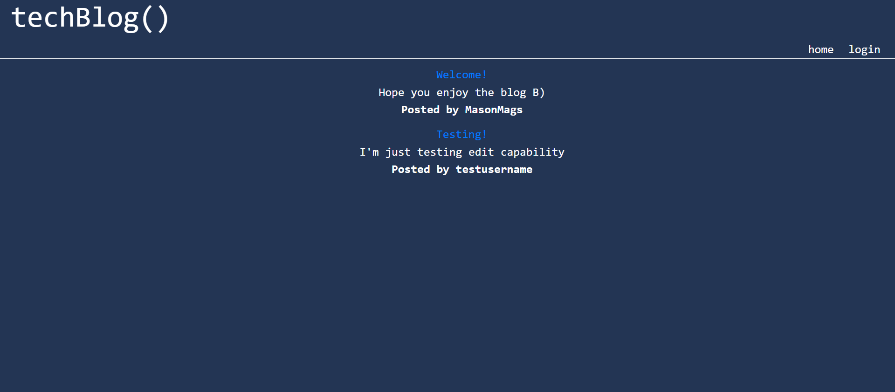

# 14 Model-View-Controller (MVC): Tech Blog

## Deployed Link

## Description

This app is a CMS-style blog site similar to a Wordpress site, where developers can publish their blog posts and comment on other developers’ posts as well. It also follows the MVC paradigm in its architectural structure, using Handlebars.js as the templating language, Sequelize as the ORM, and the express-session npm package for authentication.

## User Story

```md
AS A developer who writes about tech
I WANT a CMS-style blog site
SO THAT I can publish articles, blog posts, and my thoughts and opinions
```

## Mock-Up

The following animation demonstrates the application's interface:

 

## Grading Requirements

> **Note**: If a Challenge assignment submission is marked as “0”, it is considered incomplete and will not count towards your graduation requirements. Examples of incomplete submissions include the following:
>
> * A repository that has no code
>
> * A repository that includes a unique name but nothing else
>
> * A repository that includes only a README file but nothing else
>
> * A repository that only includes starter code

This Challenge is graded based on the following criteria:

### Technical Acceptance Criteria: 40%

* Satisfies all of the preceding acceptance criteria plus the following:

    * Application’s folder structure follows the Model-View-Controller paradigm.

    * Uses the [express-handlebars](https://www.npmjs.com/package/express-handlebars) package to implement Handlebars.js for your Views.

    * Application must be deployed to Heroku.

### Deployment: 32%

* Application deployed at live URL.

* Application loads with no errors.

* Application GitHub URL submitted.

* GitHub repository contains application code.

### Application Quality: 15%

* User experience is intuitive and easy to navigate.

* User interface style is clean and polished.

* Application resembles the mock-up functionality provided in the Challenge instructions.

### Repository Quality: 13%

* Repository has a unique name.

* Repository follows best practices for file structure and naming conventions.

* Repository follows best practices for class/id naming conventions, indentation, quality comments, etc.

* Repository contains multiple descriptive commit messages.

* Repository contains quality readme file with description, screenshot, and link to deployed application.

## Review

You are required to submit BOTH of the following for review:

* The URL of the functional, deployed application.

* The URL of the GitHub repository, with a unique name and a readme describing the project.

---
© 2022 Trilogy Education Services, LLC, a 2U, Inc. brand. Confidential and Proprietary. All Rights Reserved.
